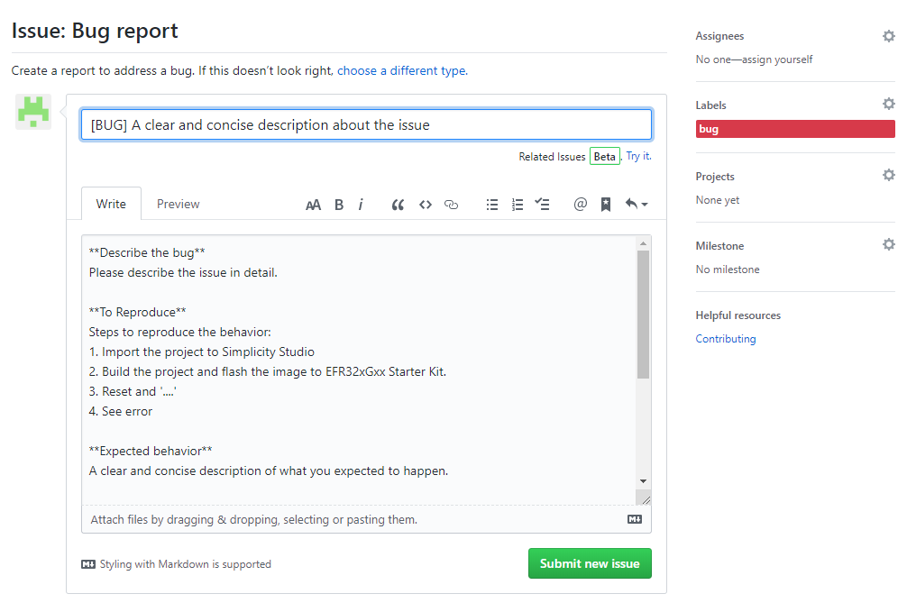
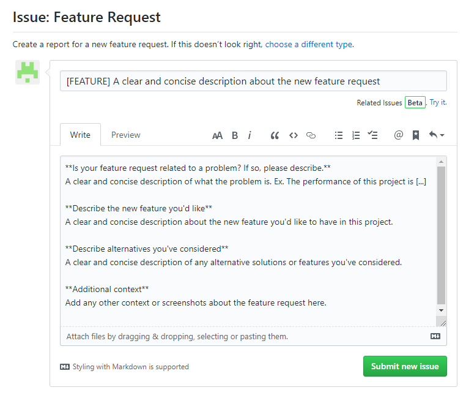
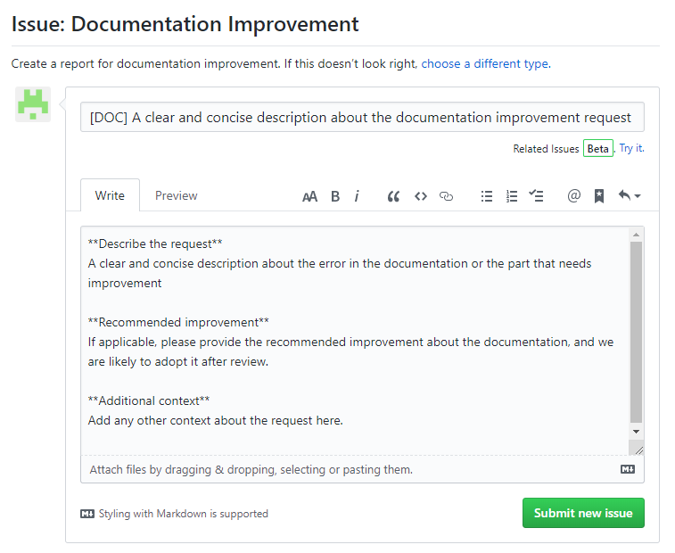
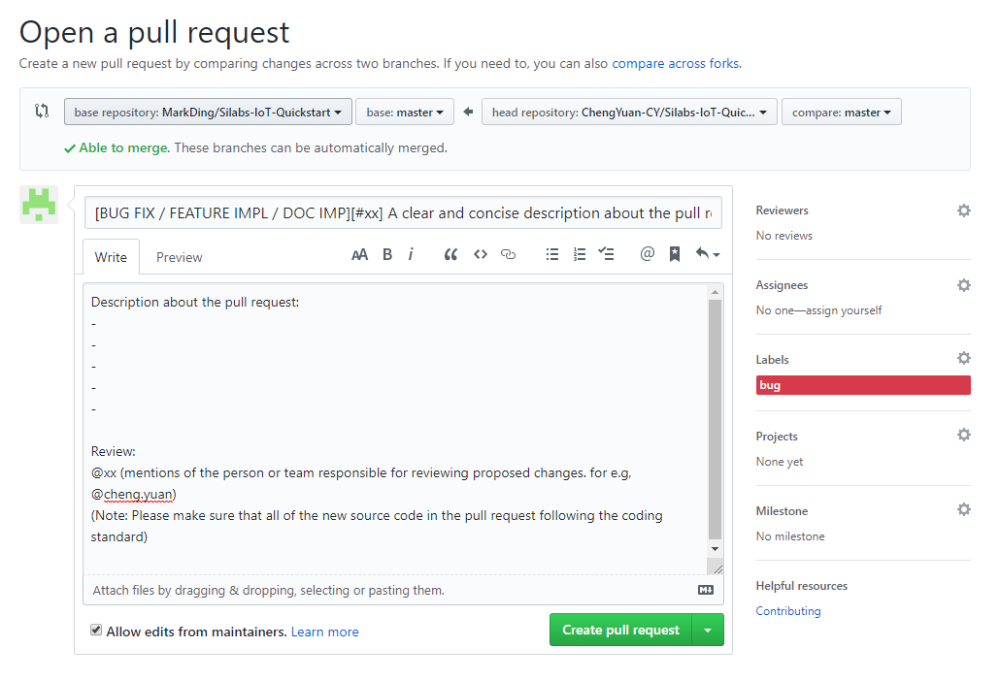
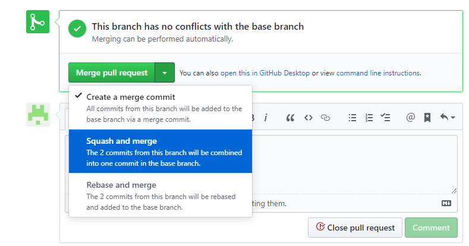

# Contributing to Silabs-IoT-Quickstart

First of all, we really appreciate your contribution on this project! 
And please follow the guidelines below for contributing to Silabs-IoT-Quickstart, it inlcudes the coding standard, approaches for how to get the source code, how to report a issue to address a bug,new feature request or documentations improvement.

#### Table Of Contents

[Code of Conduct](#Code-of-Conduct)

[Contributing guideline](#contributing-guideline)
   * [Coding standard](#coding-standard)
   * [How to get code ?](#how-to-get-code-?)
   * [How to contribute ?](#how-to-contribute-?)   
      * [Reporting issues](#reporting-issues)
         * [Report Bug](#report-Bug)
         * [New feature request](#new-feature-request)
         * [Documentation improvement](#documentation-improvement)

      * [Pull Requests](#pull-requests)

[Reversion Information](#reversion-information)

--- 

## Code of Conduct

All of the contributor involved in this project is governed by the [Silabs-IoT-Quickstart Covenant Code of Conduct](https://github.com/MarkDing/Silabs-IoT-Quickstart/blob/master/CODE-OF-CONDUCT.md). This is a open source project, and every participating in it can provide your comments on it, submit your pull request for bug fix, new feature implementation or documentation improvement.

## Contributing guideline

### Coding standard

Please refer to the [coding standard](https://github.com/MarkDing/Silabs-IoT-Quickstart/blob/master/CODING-STANDARD.md) for the description about the coding standard used in the Silabs-IoT-Quickstart project.

### How to get code ?

You can access and read the source code [here](https://github.com/MarkDing/Silabs-IoT-Quickstart).
And also clone all code from github to local with command line or GUI tool (for e.g., [Github Desktop](https://desktop.github.com/)), if use the command line, clone the repo with this command: 
`git clone https://github.com/MarkDing/Silabs-IoT-Quickstart.git -b <branch_name>`

### How to contribute ?

#### Reporting issues

This section guides you how to report a bug to us. We created three templates for different report type, Bug Report, Feature Request and Documentation Improvement request.

#### Report Bug
##### Before reporting the bug
Since there are so many contributor work on this project worldwide, it's always encouraged to search the issue list to check if this issue already exist, if so you don't need to create a duplicated one, and please just add your comments on the existing one.
And also please make sure that the issue can be reproduced reliably with the steps you provided.

Navigate to the main page of the repository and click the button . There are multiple issue types, choose the "Bug Report" to report a Bug you found in this project. 
Please help to provide the information as detailed as possible while creating a Bug report, the will help maintainers a lot for reproducing the issue.

* **Title:** A clear and concise description about the issue can highlight the focus of this issue, please note that the prefix **[BUG]** is mandatory in the title field.
* **To Reproduce:** Describe the steps for reproducing the issue as detailed as possible. 
* **Expected behavior:** Describe the symptom that you observed after following the steps above.
* **Screenshots:** Provide screenshots to demonstrate the problem. Sometimes a GIF can provide us much more information than a static picture. [GifCam](https://gifcam.en.softonic.com/) is a free and very easy to use tool for creating gif file.
* **Additional context:** You can add any other context not included in the items above but it's helpful for describing this problem here.

#### New Feature Request

You can submit your ideas about new features by submitting a "New Feature Request". In order to come up with a good New Feature proposal, please seriously consider your proposal before submitting it, and make sure it's reasonable and the user of this project will benefit from this new feature.

Navigate to the main page of the repository and click the button . There are multiple issue types, choose the "Feature Request" to submit a request for your proposal.

Please help to provide the information as detailed as possible while submitting a New Feature Request, they will help maintainer a lot for evaluating and implementing the new feature.

* **Title:** A clear and concise description about the new feature request, and all of the reader of this request can get the point quickly. please note that the prefix **[FEATURE]** is mandatory in the title field.
* **Is your feature request related to a problem? if so, please describe:** If this new feature is suggested solution for some problem your are facing while using this project, if so, please provide a clear description here.
* **Describe the new feature you'd like:** Please describe the new feature in detail.
* **Describe alternative you're considered:** If there is any alternative solutions or features you've considered, please make a description here, it will help us evaluating it.
* **Additional context：** You can add any other context not included in the items above but it's helpful for describing the new feature request here.

After receiving the new feature request, we (and all of the contributor) will help to evaluate that proposal and check it against the roadmap, and we will update the status of this request depends on the result of evaluation.
**Approved:**
We believe that the proposal is reasonable and realizable, we will update the status of this request with the schedule information.
**Pending:**
We believe that the proposal dees not fit our roadmap at this moment, and set the status of this request as pending that we will consider it later.

#### Documentation improvement

There are lots of documentations included in this repository, if you found any problem with the documentations or any suggestion about the documentation improvement, please submit a "Documentation Improvement" issue to address this request.
Navigate to the main page of the repository and click the button . There are multiple issue types, choose the "Documentation Improvement" to submit a request for documentation improvement.

* **Title:** A clear and concise description about the documentation improvement request. Please note that the prefix **[DOC]** is mandatory in the title field.
* **Describe the request:** If there is any error you found in the documentation, please describe it as [file name][line number][description]. And provide a clear and concise description if any suggestion about the improvement.
* **Recommended improvement:** If applicable, please provide the recommended improvement about the documentation, and we will likely to adopt it after review.
* **Additional context：** You can add any other context not included in the items above but it's helpful for describing the documentation improvement.

### Pull Requests

In order to maintain this repository more effectively, we only grant the read permissions to the contributor, so if you want to create a new branch for your pull request, please fork the repository first, and then make changes to the fork and submit your pull request. For more information, please see [Creating a pull request from a fork](https://help.github.com/en/articles/creating-a-pull-request-from-a-fork).

For creating a pull request from your fork, open your fork of the repository, click the "New pull request" button, a new page titled **Comparing changes** will be opened, by default, there are two branches will be shown in this page, the base repository and head repository. Please check them carefully and make sure those make sense as you are about to bringing your changes into the upstream version. Click the  to start to submit your pull request as below.

* **Title:** A clear and concise description about the pull request, there are three different kind of pull request, [BUG FIX] for bug fix, [FEATURE IMPL] for new feature implementation and [DOC IMP] for documentation improvement respectively. At least, one prefix of these three is mandatory in the title field. And the prefix should be followed by the issue ID [#xx] if this pull request is for a recorded issue.
* **Description about the pull request:** Please describe this pull request in detail. It can be a summary of all of the commits included in the pull request.
* **Review:** Please add the mentions of the person or team responsible for pull request reviewing. Please see the [Maintainers](https://github.com/MarkDing/Silabs-IoT-Quickstart/blob/master/README.md#maintainers) list of this repository.

The maintainer of this repository will receive the pull request from the contributor, and they need to review the source code or documentation change, and make sure that all of the source code change follow the [coding standard](#coding-standard). And it's required to squash the multi commits included in the pull request into one commit in the base branch. And reviewer will summarize the combined commit message.

## Reversion Information
**Revision 1.0**
   * 2019-09-25
   * Initial Revision
